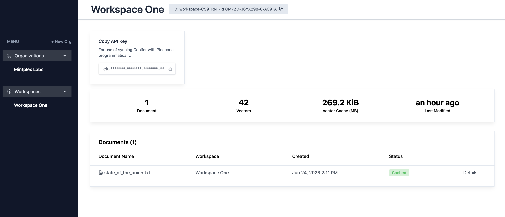
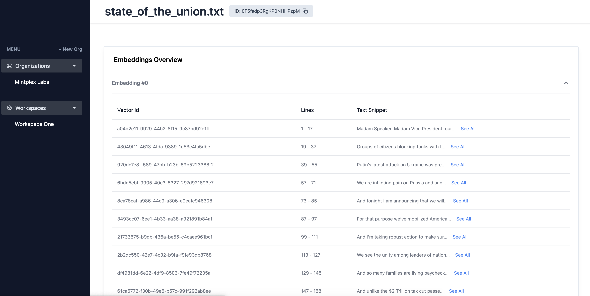

# Conifer VDBMS?

### ⚠️ This project was created during the Pinecone.io Hackathon ⚠️ 
It should be used with caution in any production environments. You can use the real application for free at
[Conifer](https://conifer-tools.web.app/).


### What is a VDBMS?

A VBMS or  _vector database management system_ is a service provider that exists to give you unparalleled insight and utility into _what_ is in your database with the atomic control to add or remove specific vectors and documents.

### What can Conifer do?
- UI dashboard to see exactly what is embedded in your Pinecone instance
- Automatic sync of vectors as you use popular AI tooling libraries like `langchain`
- Ability to view specific documents and vectors and also _atomically_ delete and modify them via a standard interface.

### Why does this exist?
You already know how to effectively create and chat with your documents using tools like `LangChain`, `OpenAI` and `Pinecone`, but what about when you want to...

- Manage independent documents.
- Manage independent embeddings of a single document.
- Cache duplicated embeddings savings you a ton on embedding costs at scale.
- Duplicate documents across multiple Pinecone namespaces without paying to re-embed.

_future developments_
- See how often a document is referenced in chat.
- Permission documents to be used in chat applications.

... and do all of this without rewriting your entire codebase or rolling your own implementation of trying to keep track of embeddings and vector ids? Now do that again with a simple UI for the non-technical people in your team.

-> Thats [Conifer](https://conifer-tools.web.app/).

### How to use Conifer to sync with my embeddings?
Conifer exists as a custom fork of LangChainJS currently, hopefully will become main soon. For now, its just like using langchainJS or Pinecone's JS Client!

Add this to your `package.json` dependencies.
```
"@mintplex-labs/langchain": "https://gitpkg.now.sh/Mintplex-Labs/langchainjs/langchain?conifer",
```

And in your code where you are creating documents and embedding them...
```
import fs from 'fs'
import { PineconeClient } from "@pinecone-database/pinecone";
import { PineconeStore } from "@mintplex-labs/langchain/dist/vectorstores/pinecone.js";
import { ConiferVDBMS } from "@mintplex-labs/langchain/dist/vdbms/conifer.js"
import { OpenAIEmbeddings } from "langchain/embeddings/openai";
import { RecursiveCharacterTextSplitter } from 'langchain/text_splitter'

const INDEX = 'hackathon'
const NAMEPSPACE = 'testing-collection'
const client = new PineconeClient();
await client.init({
  apiKey: 'your-pinecone-io-key',
  environment: 'us-central1-gcp',
});

const openAiEmbedding = new OpenAIEmbeddings({ openAIApiKey: 'sk-xxxxxxxx' })
const pineconeIndex = client.Index(INDEX);
const pineconeConfig = {
  pineconeIndex,
  namespace: NAMEPSPACE,
}

const coniferInstance = new ConiferVDBMS({
  orgId: 'org-XXXXX', // get this from Conifer
  workspaceId: 'workspace-xxxxxx', // get this from Conifer workspaces
  apiKey: 'ck-xxxxxx', // get this from Conifer
})

// Insert documents
const TextDocument = fs.readFileSync('./state_of_the_union.txt', 'utf-8')
const textSplitter = new LSTextSplitter.RecursiveCharacterTextSplitter({
  chunkSize: 1000,
  chunkOverlap: 20,
});

const document = await textSplitter.createDocuments([TextDocument], [{ documentTitle: 'state_of_the_union.txt' }])
await PineconeStore.fromDocumentsVerbose(
  document,
  openAiEmbedding,
  pineconeConfig,
  coniferInstance
)

// Now go look on your Conifer workspace and you will see your document and its individual embeddings!
```






### Other Methods Available (in development)

`coniferInstance.getDocuments(workspaceId?: string)`: Get all documents currently embedded in pinecone and synced with Conifer.

`coniferInstance.deleteAllWorkspaceDocuments(pineconeIndex: PineconeLibArgs['pineconeIndex'], pineconeNamespace: string)`: Delete all documents in Pinecone and Conifer in a single instance.

`coniferInstance.deleteDocument(pineconeIndex:PineconeLibArgs['pineconeIndex'], pineconeNamespace: string, coniferDocumentId: string)`: Delete a specific document from pinecone & Conifer in a single call.

`coniferInstance.copyDocumentToNamespace(pineconeIndex: PineconeLibArgs['pineconeIndex'], targetPineconeNamespace: string, coniferDocumentId: string, targetWorkspaceId: string)`: Copy an entire embedded document to another Pinecone workspace without paying to re-embed.
